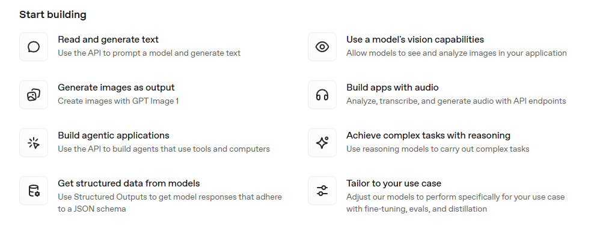
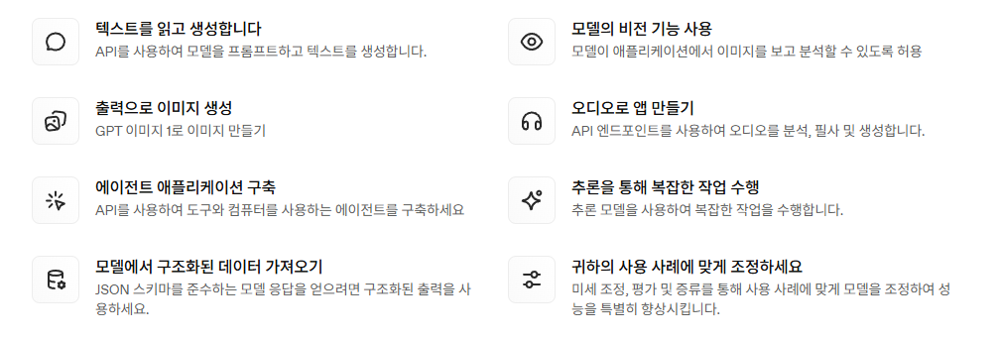

# S00. 클로드 이해하기

- LLM 기반의 대화형 서비스 : 클로드(Claude), 챗GPT(ChatGPT), 퍼플렉시티(Perplexity)

- OpenAI 공식 문서 : [platform.openai.com/docs/overview](https://platform.openai.com/docs/overview)

### 애플리케이션 통합에 능한 서비스, 클로드

|      | 챗GPT | 클로드 |
|------|:-----:|:-----:|
| 웹 검색         |  가능  |  가능  |
| 이미지 새성      |  가능  | 불가능  |
| 글쓰기          |  가능  |  가능  |
| 코딩            |  가능  |  가능  | 
| 심층 리서치      |  가능  |  가능  |
| 애플리케이션 통합 | 불가능  |  가능  | 
| | 　　　　　　　　　　　　　　　　 | 　　　　　　　　　　　　　　　　 |

- 클로도의 강점은 통합 
  - 클로드의 도구에는 구글 드라이브, G메일, 구글 캘린더 검색이 있지만, 챗GPT에는 그런것이 없다.
  - 클로드에 구글 계정을 연결하면 해당 계정의 구글 드라이브, 지메일, 캘린더를 검색할 수 있다. 
  - 외부 애플리케이션을 클로드의 영역으로 가지고 올 수 있다. 

- MCP의 등장으로 클로드와 같은 LLM 서비스에 구글 드라이브, 지메일, 구글 캘린더와 같은 다양한 애플리케이션을 붙일 수 있게 되었다.
