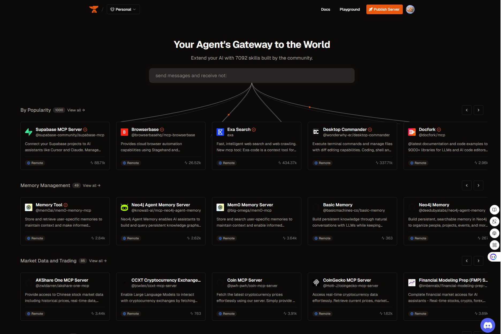

# S02. MCP 이해하기

### 비개발자 관점에서 MCP
- MCP라 말하는 것은 MCP 서버를 의미
- 엄밀히 MCP는 프로토콜이지, MCP 서버를 의미하지는 않지만 편의상 MCP라고 부른다.
- MCP를 이해하기 위해, 가장 적절한 비유중 하나는 브라우저의 `확장 프로그램`이다.

### MCP 설치 준비하기
> Desktop COmmander MCP 설치, 다음은 설치조건을 갖춰야 한다.
- 스미더리 개인 API 설정하기 : [서미더리](https://smithery.ai/)
- Node.js 설치하기
- MCP 설치 명령어 복사하여 `명령 프롬프트`에 붙여넣기
- 클로드 개발자 모드 ON

